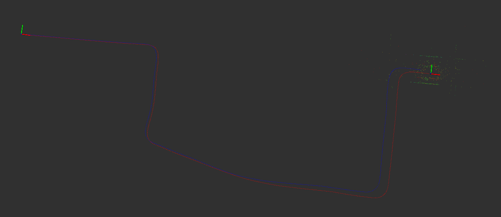

# LIDAR and Vision Odometry

<p align="center">
  
   <br>
  <em>Estimated (red) vs. ground truth (blue) trajectory on KITTI sequence 00 using LIDAR point clouds</em>
</p>

This repository contains implementations of LIDAR-based and stereo vision–based odometry. A complete evaluation pipeline for the KITTI dataset is provided. Both approaches are wrapped in ROS2 nodes to enable visualization of trajectories and point clouds in **RViz2**.

## Features

- LIDAR odometry based on Iterative Closest Point (ICP)
- Stereo vision odometry based on feature matching and PnP
- Evaluation on the KITTI dataset
- ROS2 integration with RViz2 visualization
- Ground truth and estimated trajectory comparison

## Running the Code

Create a workspace and clone the repository:

```bash
mkdir -p ws/src
cd ws/src
git clone <this-repository>
```

Build the ROS2 package:

```bash
cd ..
colcon build
source install/local_setup.bash
```

Run the nodes:

```bash
ros2 run lidar_vo lidar_node
```

or

```bash
ros2 run lidar_vo slam_node
```

The first command runs the LIDAR-based odometry, while the second runs the stereo vision–based odometry.

> **Note**  
> Before running the code, update the paths to the KITTI dataset (sequences and ground truth files) in the configuration or source files.

## Implementation Details

### LIDAR Odometry

LIDAR odometry is implemented using the Iterative Closest Point (ICP) algorithm. The processing pipeline is:

1. Read two consecutive point clouds and store them as `pcl::PointCloud` objects  
2. Downsample the point clouds to improve efficiency  
3. Initialize the relative transformation:
   - Identity transform, or  
   - Previously estimated transformation  
4. Iteratively refine the alignment:
   - Compute point correspondences  
     - Naive Euclidean distance–based method  
     - KD-tree–based nearest neighbor search  
   - Perform 50 RANSAC iterations for robust alignment  
5. Concatenate the estimated transformation to obtain the global vehicle pose  
6. Publish:
   - Estimated trajectory  
   - Ground truth trajectory  
   - Aligned point cloud  

### Stereo Vision Odometry

Stereo vision odometry uses rectified stereo image pairs from the KITTI dataset. The relative pose between consecutive frames is estimated using a PnP formulation.

The pipeline is as follows:

1. Read two consecutive stereo pairs  
2. Detect and match features between the left images of consecutive frames  
3. Keep only features that are successfully matched temporally  
4. Match features between left and right images of the earlier stereo pair  
5. Filter stereo matches:
   - Positive disparity  
   - Similar y-coordinates (horizontal epipolar constraint)  
6. Remove temporal matches without valid stereo correspondences  
7. Triangulate 3D points from stereo matches using known left–right camera calibration  
8. Form 3D–2D correspondences and solve the PnP problem  
9. Concatenate the inverse of the estimated transformation to recover the pose in the global coordinate frame  

## TODO

- Integrate sliding window bundle adjustment (already implemented using **g2o**) into the vision odometry pipeline  
- Implement loop closure detection using a bag-of-words approach  
- Apply pose graph optimization after loop closure detection to improve global trajectory consistency  
